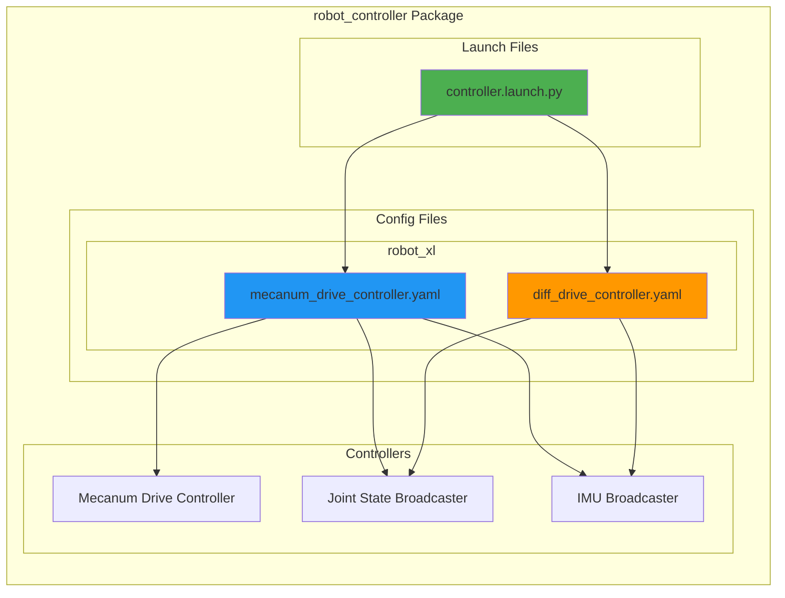
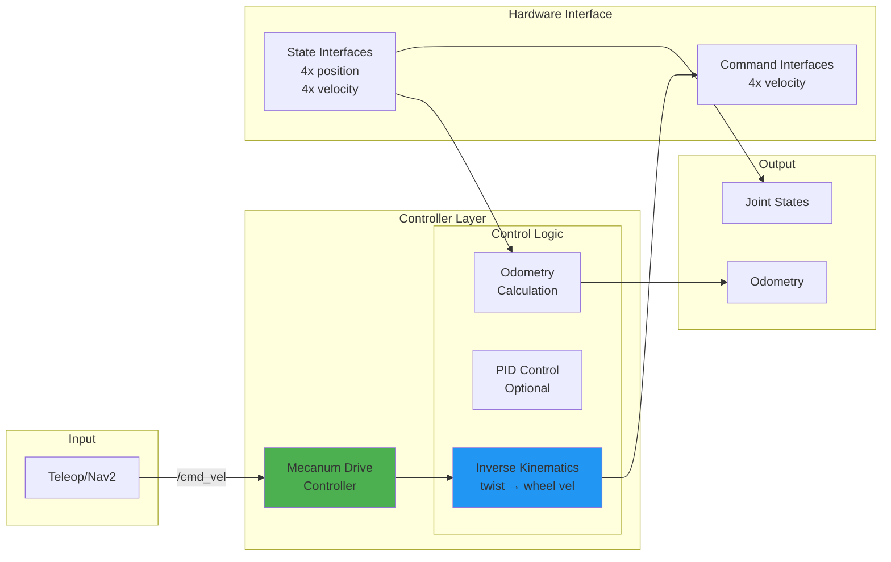
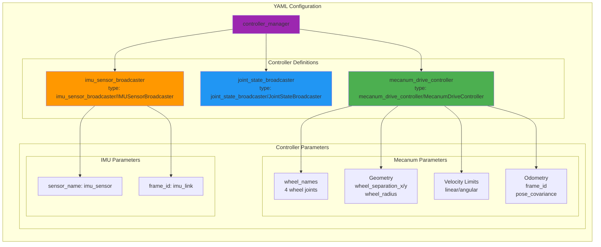
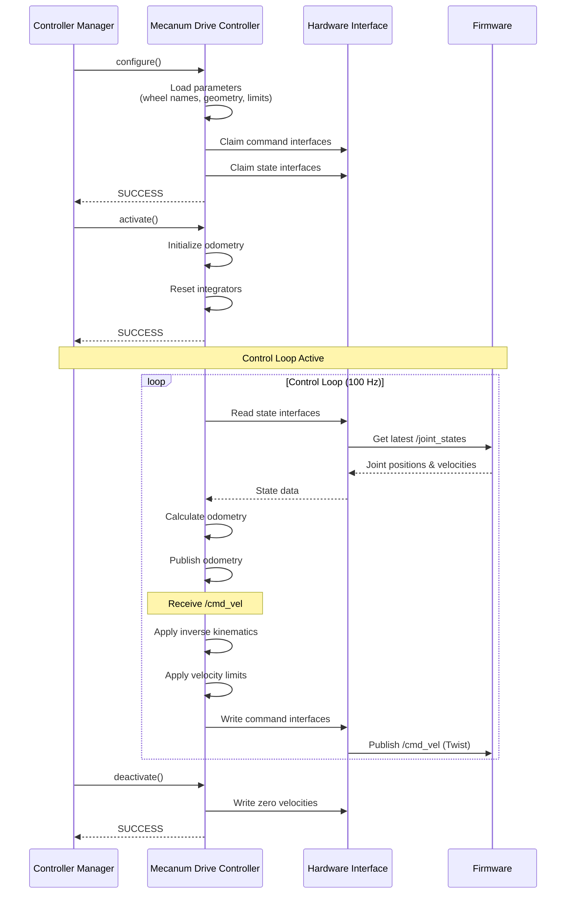
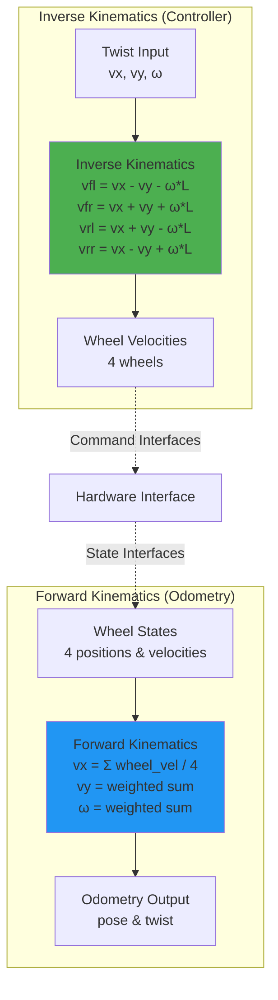
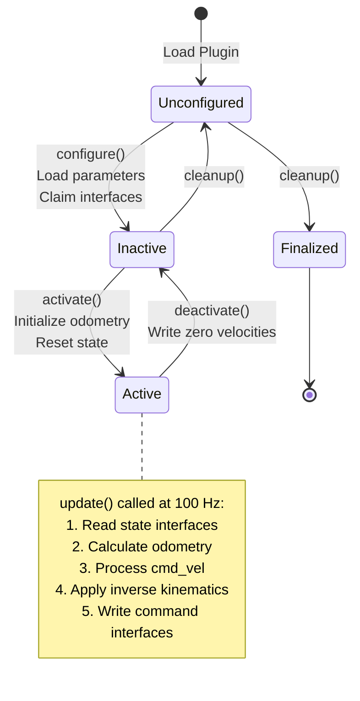

# robot_controller Architecture

## Overview

This package contains controller configurations for the robot_xl platform, supporting both mecanum and differential drive types.

## Package Structure



## Controller Architecture

```mermaid
graph TB
    subgraph "Controller Manager"
        CM[controller_manager<br/>Lifecycle Management]
    end
    
    subgraph "Controllers"
        MDC[mecanum_drive_controller<br/>Velocity Control]
        JSB[joint_state_broadcaster<br/>State Publishing]
        IB[imu_sensor_broadcaster<br/>IMU Publishing]
    end
    
    subgraph "Hardware Interface"
        HWI[RobotSystem<br/>Command & State Interfaces]
        IMU_HW[RobotImuSensor<br/>IMU State Interfaces]
    end
    
    subgraph "ROS2 Topics"
        CMD[/cmd_vel<br/>Input]
        ODOM[/odometry/wheels<br/>Output]
        JS[/joint_states<br/>Output]
        IMU[/imu/data<br/>Output]
    end
    
    CM --> MDC
    CM --> JSB
    CM --> IB
    
    CMD --> MDC
    MDC -->|velocity commands| HWI
    HWI -->|state interfaces| MDC
    MDC --> ODOM
    
    HWI -->|state interfaces| JSB
    JSB --> JS
    
    IMU_HW -->|state interfaces| IB
    IB --> IMU
    
    style CM fill:#9C27B0
    style MDC fill:#4CAF50
    style JSB fill:#2196F3
    style IB fill:#FF9800
```

## Data Flow Diagram



## Controller Configuration Structure



## Sequence Diagram: Controller Lifecycle



## Mecanum Drive Kinematics



## Topic Remapping

```mermaid
graph LR
    subgraph "Controller Topics"
        direction TB
        CMD_IN[drive_controller/cmd_vel_unstamped]
        ODOM_OUT[drive_controller/odom]
        IMU_IN[imu_sensor_node/imu]
        IMU_OUT[imu_sensor_broadcaster/imu]
    end
    
    subgraph "Remapped Topics"
        direction TB
        CMD[/cmd_vel]
        ODOM[/odometry/wheels]
        IMU_RAW[/imu/data_raw]
        IMU_DATA[/imu/data]
    end
    
    CMD --> CMD_IN
    ODOM_OUT --> ODOM
    IMU_RAW --> IMU_IN
    IMU_OUT --> IMU_DATA
    
    style CMD fill:#4CAF50
    style ODOM fill:#2196F3
    style IMU_RAW fill:#FF9800
    style IMU_DATA fill:#9C27B0
```

## Configuration Parameters

### Mecanum Drive Controller

| Parameter | Type | Default | Description |
|-----------|------|---------|-------------|
| `wheel_names` | string[] | - | Names of 4 wheel joints (FL, FR, RL, RR) |
| `wheel_separation_x` | double | 0.270 | Distance between front and rear wheels (m) |
| `wheel_separation_y` | double | 0.170 | Distance between left and right wheels (m) |
| `wheel_radius` | double | 0.047 | Wheel radius (m) |
| `linear.x.max_velocity` | double | 0.5 | Max linear velocity in x (m/s) |
| `linear.y.max_velocity` | double | 0.5 | Max linear velocity in y (m/s) |
| `angular.z.max_velocity` | double | 1.0 | Max angular velocity (rad/s) |
| `odom_frame_id` | string | odom | Odometry frame name |
| `base_frame_id` | string | base_link | Base frame name |
| `pose_covariance_diagonal` | double[] | [0.001, ...] | Pose covariance (6 values) |
| `twist_covariance_diagonal` | double[] | [0.001, ...] | Twist covariance (6 values) |

### Joint State Broadcaster

| Parameter | Type | Default | Description |
|-----------|------|---------|-------------|
| `joints` | string[] | - | Joint names to broadcast |
| `interfaces` | string[] | [position, velocity] | State interfaces to publish |

### IMU Sensor Broadcaster

| Parameter | Type | Default | Description |
|-----------|------|---------|-------------|
| `sensor_name` | string | imu_sensor | Name of IMU sensor in URDF |
| `frame_id` | string | imu_link | IMU frame name |

## State Machine: Controller States



## Performance Characteristics

- **Update Rate**: 100 Hz (10 ms period)
- **Odometry Calculation**: < 1 ms
- **Inverse Kinematics**: < 0.1 ms
- **Command Latency**: < 10 ms (end-to-end)
- **Odometry Accuracy**: ±2% (wheel slip dependent)

## Error Handling

| Error Condition | Detection | Action | Recovery |
|----------------|-----------|--------|----------|
| Missing wheel joint | Configuration | Fail to configure | Fix URDF/config |
| Invalid geometry | Parameter validation | Fail to configure | Fix parameters |
| Command timeout | No cmd_vel received | Continue with last command | Automatic on new command |
| State read failure | Hardware interface error | Log error, use last state | Automatic on next cycle |
| Velocity limit exceeded | Input validation | Clamp to limits | Automatic |

## Launch File Structure

### controller.launch.py

**Purpose**: Load and activate all controllers

**Key Features**:
- Load controller manager configuration
- Spawn controllers in correct order
- Configure topic remappings
- Handle controller lifecycle

**Spawned Controllers**:
1. `joint_state_broadcaster` (first - provides joint states)
2. `imu_sensor_broadcaster` (IMU data)
3. `mecanum_drive_controller` (last - depends on joint states)

## Dependencies

- **controller_manager**: Controller lifecycle management
- **mecanum_drive_controller**: Custom mecanum controller (from robot_controllers package)
- **joint_state_broadcaster**: Standard ros2_controllers
- **imu_sensor_broadcaster**: Standard ros2_controllers
- **robot_hardware_interfaces**: Hardware interface plugin

## Usage Examples

### Launch Controllers
```bash
ros2 launch robot_controller controller.launch.py
```

### List Controllers
```bash
ros2 control list_controllers
```

### Check Controller Status
```bash
ros2 control list_hardware_interfaces
```

### Send Velocity Command
```bash
ros2 topic pub /cmd_vel geometry_msgs/msg/Twist \
  "{linear: {x: 0.1, y: 0.0, z: 0.0}, angular: {x: 0.0, y: 0.0, z: 0.0}}"
```

### Monitor Odometry
```bash
ros2 topic echo /odometry/wheels
```

### Monitor Joint States
```bash
ros2 topic echo /joint_states
```

## Troubleshooting

| Issue | Possible Cause | Solution |
|-------|---------------|----------|
| Controller fails to load | Wrong controller type | Check controller_manager config |
| No odometry published | Controller not active | Check controller state |
| Robot doesn't move | No cmd_vel received | Check topic remapping |
| Incorrect motion | Wrong kinematics parameters | Verify wheel_separation and wheel_radius |
| Jerky motion | Velocity limits too low | Increase max_velocity parameters |
| Drift in odometry | Wheel slip or wrong parameters | Calibrate wheel radius, check for slip |
